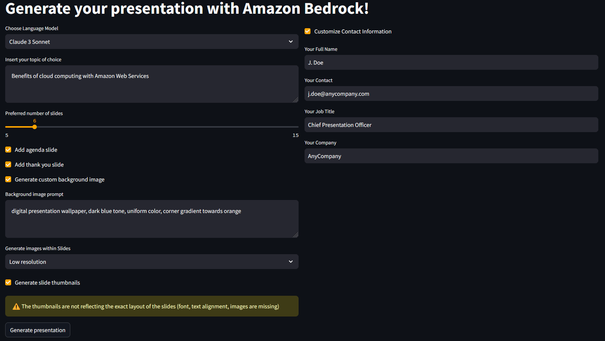
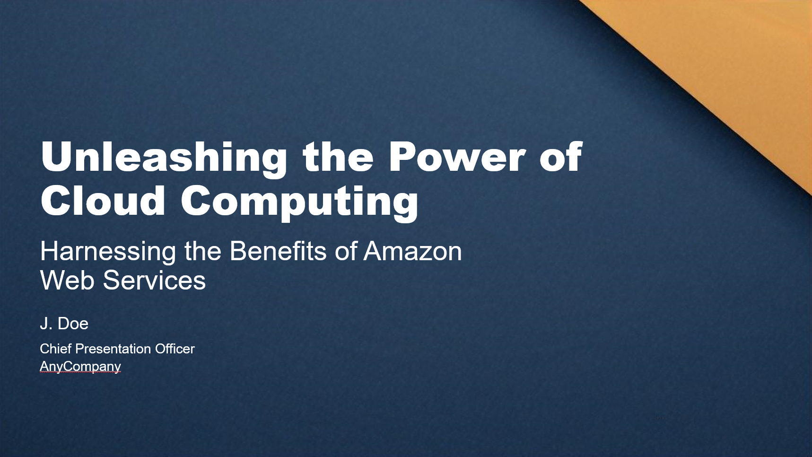

# Generate your presentation with LLMs on Amazon Bedrock

This application leverages Generative AI on AWS to create presentations with text, images and professional layout.
### Key features:
- Leverages Amazon Bedrock service with Claude 3 and Amazon Titan Image Generator models
- Provides prompt moderation against harmful or violent content
- Entirely written in python, leverages [python-pptx](https://pypi.org/project/python-pptx/) library for backend and [Streamlit](https://pypi.org/project/streamlit/) for frontend
- Creates arbitrary combination of layouts through mapping of base template 
- Handles output content in JSON format
- Self-heals against formatting and output errors
- Generates agenda and thank you slides
- Generates slide thumbnails through slides rendering via OpenOffice integration
- Adds contact information
- Customizable number of slides
- Computes elapsed time, number of input and output tokens, presentation generation cost

### How to use:

- Add topic to the text input area
- Select options on model, pictures, thumbnails, etc
- Click "Generate"
- Download the generated presentation

### Look and feel

- Frontend page:


- Output example


## Installation

### Infrastructure setup

- Pick a region, e.g. `us-east-1`

- [Launch an EC2 instance](https://docs.aws.amazon.com/AWSEC2/latest/UserGuide/ec2-launch-instance-wizard.html#liw-quickly-launch-instance) with Amazon Linux OS with a Key pair for login (t2.medium is enough, increase the disk size to 50GB)
    - Ensure that the associated EBS volume is encrypted, as suggested in the [Configure storage section](https://docs.aws.amazon.com/AWSEC2/latest/UserGuide/ec2-launch-instance-wizard.html#liw-quickly-launch-instance)
    - Enable [termination protection](https://docs.aws.amazon.com/AWSEC2/latest/UserGuide/Using_ChangingDisableAPITermination.html) to protect the instance from being accidentally terminated
    - Activate an operating system patching and maintenance system like the [patch manager of AWS Systems Manager](https://docs.aws.amazon.com/systems-manager/latest/userguide/patch-manager.html)

- Create a [IAM role](https://docs.aws.amazon.com/IAM/latest/UserGuide/access_policies_job-functions_create-policies.html) allowing access to the required models in Amazon Bedrock, e.g. defining the following [inline policy](https://docs.aws.amazon.com/IAM/latest/UserGuide/access_policies_job-functions_create-policies.html)
```
{
    "Version": "2012-10-17",
    "Statement": [
        {
            "Sid": "pptxBedrockAllow",
            "Effect": "Allow",
            "Action": [
                "bedrock:InvokeModel",
                "bedrock:InvokeModelWithResponseStream"
            ],
            "Resource": ["arn:aws:bedrock:us-east-1::foundation-model/anthropic.claude-3-sonnet-20240229-v1:0",
                        "arn:aws:bedrock:us-east-1::foundation-model/anthropic.claude-3-haiku-20240307-v1:0",
                        "arn:aws:bedrock:us-east-1::foundation-model/amazon.titan-image-generator-v1"]
        }
    ]
}
```
and [attach it to the EC2 instance](https://docs.aws.amazon.com/AWSEC2/latest/UserGuide/iam-roles-for-amazon-ec2.html#attach-iam-role).

- Enable the Claude 3 models in the [Amazon Bedrock console](https://docs.aws.amazon.com/bedrock/latest/userguide/model-access.html)
    - Consider enabling [model invocation logging](https://docs.aws.amazon.com/bedrock/latest/userguide/model-invocation-logging.html) and set alerts to ensure adherence to any responsible AI policies.	Model invocation logging is disabled by default.


- Enable encryption in transit and allow traffic only through the Load Balancer
    - Launch an [Application Load Balancer](https://docs.aws.amazon.com/elasticloadbalancing/latest/application/application-load-balancer-getting-started.html) with a dedicated Security group opened to receive traffic from the internet
    - Add an [HTTPS listener](https://docs.aws.amazon.com/elasticloadbalancing/latest/application/create-https-listener.html) on the port `8001` of the Load Balancer which will be used to launch the application (change it accordingly if another port is used below), pointing to the target group containing the EC2 instance
    - Open the port `8001` of the EC2 Security Group port to accept traffic from the Load Balancer Security Group

### Application setup

- [Login into the EC2 via SSH](https://docs.aws.amazon.com/AWSEC2/latest/UserGuide/connect-linux-inst-ssh.html) and update the system packages 
```
sudo yum update
```

- Install git: 
```
sudo yum install -y git
```

- Register git credentials (change name and email!)
```
git config --global user.name "My First and Last Name"
```
```
git config --global user.email "myname@myemail.com"
```

- Install OpenOffice to be able to render the slides thumbnails (cfr [these instructions](https://www.javatpoint.com/how-to-install-apache-openoffice-on-centos))
    - **NB** if OpenOffice is not installed, no error will be thrown by the frontend but no thumbnails will be generated
```
wget https://master.dl.sourceforge.net/project/openofficeorg.mirror/4.1.5/binaries/en-GB/Apache_OpenOffice_4.1.5_Linux_x86-64_install-rpm_en-GB.tar.gz?viasf=1
tar xvf Apache_OpenOffice_4.1.5_Linux_x86-64_install-rpm_en-GB.tar.gz
cd en-GB/RPMS/
sudo rpm -Uvh *.rpm
cd ~/
```

- Install other  dependencies required by OpenOffice
```
sudo yum install -y libXrender.x86_64
sudo yum install -y libXtst.x86_64
sudo yum install -y libxcrypt-compat
sudo yum install -y libXext.x86_64
sudo yum install -y xorg-x11-server-Xvfb
```

- Install the python virtual environment manager `poetry` as per [these instructions](https://www.digitalocean.com/community/tutorials/how-to-install-poetry-to-manage-python-dependencies-on-ubuntu-22-04)
```
curl -sSL https://install.python-poetry.org | python3 -
```

- Clone the repository
```
git clone https://github.com/aws-samples/generate-your-presentation-with-llm.git
```


- Enter in the repository folder 
```
cd generate-your-presentation-with-llm
```

- Install the repository python dependencies with 
```
poetry lock
poetry install
```

- Activate the environment with 
```
poetry shell
```

- Start a `screen` terminal to be able to run a detached session after logout ([more info about screen here](https://www.geeksforgeeks.org/screen-command-in-linux-with-examples/))

```
screen
```

- insert your preferred password in the [secrets.toml](.streamlit/secrets.toml) file, replacing the *unquoted* string `YOUR_SECRET_PASSWORD`. The application will throw an exception of kind `toml.decoder.TomlDecodeError: This float doesn't have a leading digit` and will not start if this string is not replaced

- launch the application within the `screen` terminal
```
streamlit run pptx-generator.py --server.enableCORS true --server.port 8001 --browser.serverPort 8001
```

- To exit out the `screen` without interrupting the session use the keyboard combination `Ctrl+a+d`, to connect again to the session use the command `screen -r`


- login to the public page with the provided credentials (default is user: `admin`)
